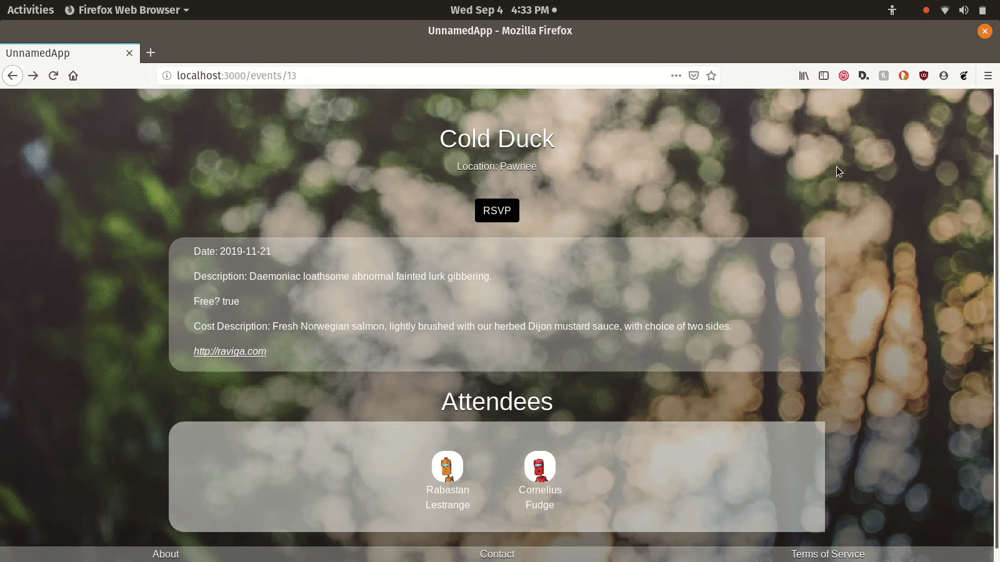
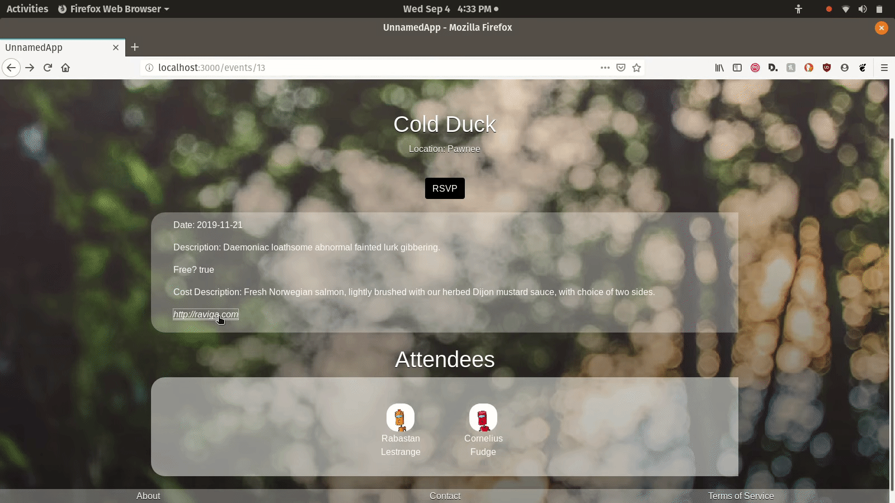

# TRANQ

Yoon (Duong) said "
  I DONT KNOW WHAT TO CALL THE APP YET!
  BUT ITS AWESOME.
  It's NEW meetup.
"

He's right! *Tranq* is a social media app based around events. It uses Rails front and back to list events and connect users through those events.

## Demo

The website's home page lists all available events that a user can visit.

Events display basic data and a link to more details.

Visitors may not RSVP to events, but must log in or sign up first.

Links at the footer explain what the app is all about.

Users can sign up any time to connect to other users and discover what events they are attending.

Once logged in, a user can RSVP to an event.

A user can RSVP to as many events as they please.

Users can update their profiles by changing their display name, adding a bio or avatar.

Users can view which other users are attending a common event, or delete the RSVP just in case they don't want to run into any trouble makers (Momo!)

The app uses Rails sessions to keep the user logged in, even on refresh.

#### Developed by Duong (Yoon) Nguyen and Joseph Syverson over the course of about five days, June 2019
